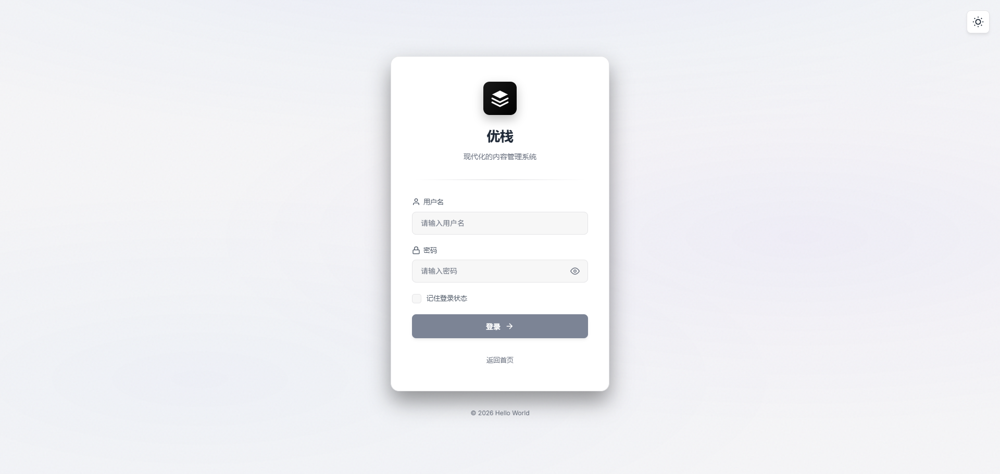
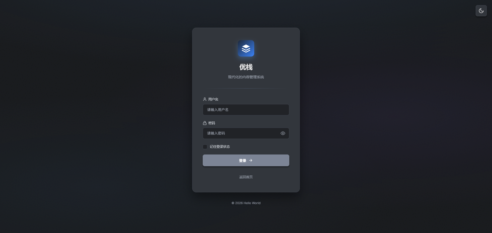
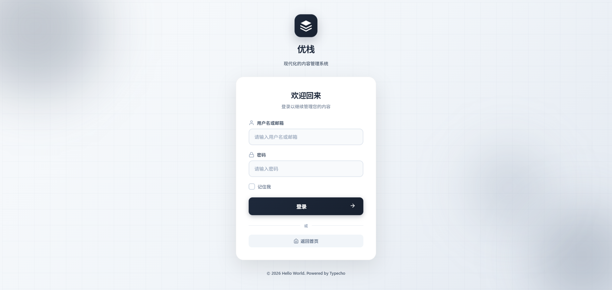
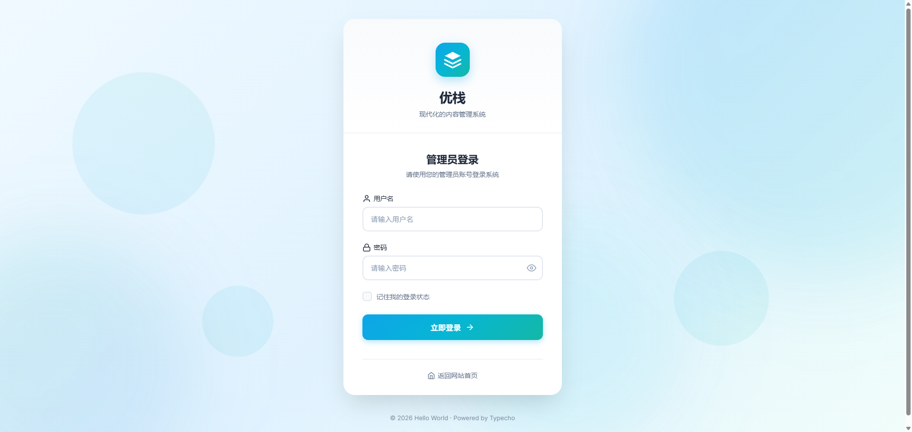
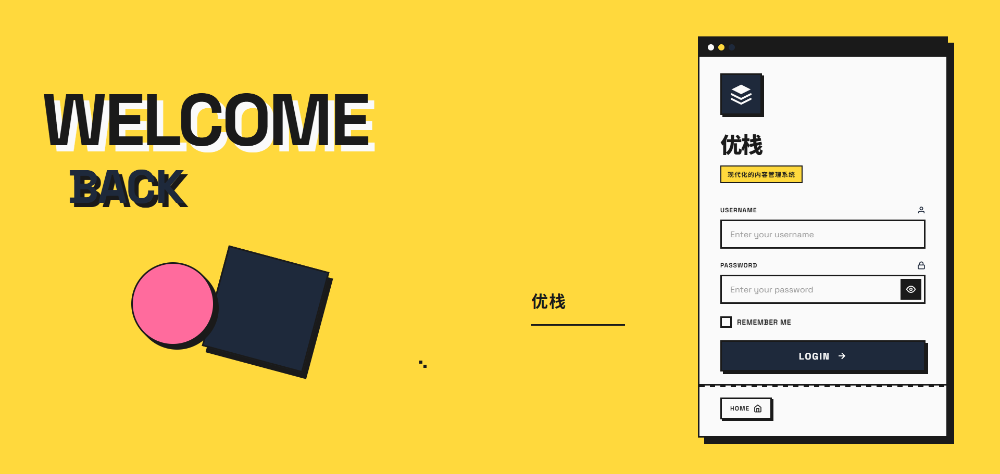
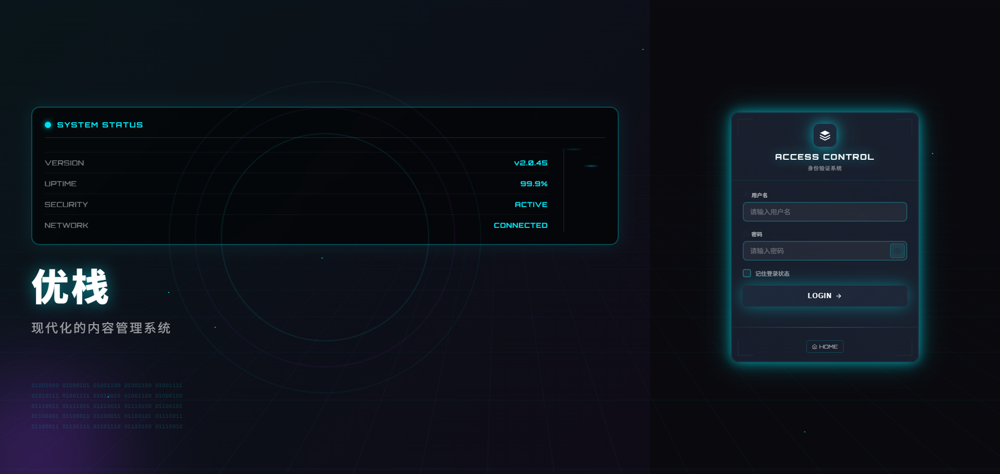

# GateLogin - Typecho 登录页面美化插件

> 6款精美登录模板，支持主题切换，让您的登录页面更具个性

## ✨ 特性

- 🎨 **6款精美模板** - 简约双模、简约现代、极光风格、大气庄重、新野兽派、科技未来
- 🌓 **主题切换** - 部分模板支持亮色/暗色主题切换
- 🎯 **简单配置** - 可视化配置界面，无需修改代码
- 🖼️ **自定义图标** - 支持自定义 Logo 图标
- 📝 **自定义文案** - 可自定义底部版权信息
- 📱 **响应式设计** - 完美适配各种设备

## 🎨 模板预览

### 1. 简约双模 (Default)
支持亮白/暗黑主题切换，极简设计

<table>
  <tr>
    <td align="center"><b>亮色模式</b></td>
    <td align="center"><b>暗色模式</b></td>
  </tr>
  <tr>
    <td></td>
    <td></td>
  </tr>
</table>

### 2. 简约现代 (Simple)
单卡片居中布局，圆形背景装饰

### 3. 极光风格 (Aurora)
双栏布局，极光背景动画，玻璃态设计

### 4. 大气庄重 (Prestige)
浅色系配色，渐变背景，现代简洁

### 5. 新野兽派 (Brutal)
粗边框硬阴影，高对比度，大胆几何

### 6. 科技未来 (Tech)
赛博朋克风格，霓虹光效，动态网格

## 📦 安装

1. 下载插件文件到 `usr/plugins/GateLogin/` 目录
2. 进入 Typecho 后台 **插件管理**
3. 启用 **GateLogin** 插件
4. 进入插件设置页面进行配置

## ⚙️ 配置说明

### 基本配置

| 配置项 | 说明 |
|--------|------|
| 🏷️ 网站标题 | 登录页面显示的网站标题，留空则使用系统默认标题 |
| 💬 副标题 | 标题下方显示的副标题或标语 |
| 🎨 登录模板 | 选择登录页面的显示模板风格 |
| 🖼️ 图标地址 | Logo 图标的图片地址，留空则使用默认图标 |
| 📝 底部文案 | 页面底部显示的文字，支持变量：`{year}` 年份，`{title}` 网站标题 |

### 模板说明

| 模板 | 特点 | 主题切换 |
|------|------|----------|
| 🌓 简约双模 | 极简设计，居中布局 | ✅ 支持 |
| ✨ 简约现代 | 单卡片，圆形装饰 | ❌ 不支持 |
| 🌌 极光风格 | 玻璃态，极光动画 | ❌ 不支持 |
| 💎 大气庄重 | 渐变背景，现代简洁 | ❌ 不支持 |
| 🎨 新野兽派 | 粗边框，硬阴影 | ❌ 不支持 |
| 🚀 科技未来 | 霓虹光效，赛博朋克 | ❌ 不支持 |

## 🎯 使用技巧

1. **预览功能** - 在设置页面选择模板时，可以实时预览模板效果
2. **主题切换** - "简约双模"模板支持在登录页面点击右上角按钮切换亮色/暗色主题
3. **自定义图标** - 建议使用正方形 PNG 图标，尺寸建议 128x128 或 256x256
4. **底部文案** - 可以使用变量动态显示年份和网站标题

## 📝 更新日志

### v1.0.0 (2024-03-22)
- 🎉 首次发布
- ✨ 新增 6 款精美登录模板
- 🌓 支持主题切换功能
- 🎨 可视化配置界面
- 📷 模板预览功能

## 📄 开源协议

本项目采用 [MIT License](LICENSE) 开源协议

## 👨‍💻 作者

**优优**

- 个人博客: [https://blog.uuhb.cn](https://blog.uuhb.cn)
- GitHub: [https://github.com/Moze54/GateLogin](https://github.com/Moze54/GateLogin)

## 🤝 贡献

欢迎提交 Issue 和 Pull Request！

## ⭐ Star History

如果这个项目对你有帮助，请给个 Star 支持一下！

---

**GateLogin** - 让您的 Typecho 登录页面更加美观！
